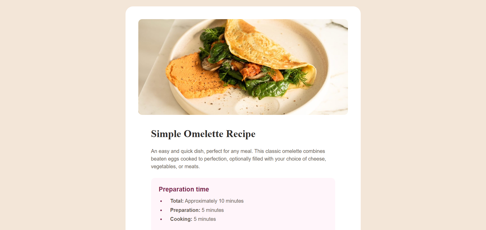

# Frontend Mentor - Recipe Page Solution

Ini adalah solusi untuk [Recipe page challenge on Frontend Mentor](https://www.frontendmentor.io/challenges/recipe-page-KiTsR8s6S6). Tantangan ini bertujuan untuk melatih kemampuan dasar HTML dan CSS dengan membangun halaman resep yang responsif.

## Daftar Isi

- [Ringkasan](#ringkasan)
  - [Tantangan](#tantangan)
  - [Screenshot](#screenshot)
  - [Link](#link)
- [Proses Saya](#proses-saya)
  - [Dibuat Dengan](#dibuat-dengan)
  - [Apa Yang Saya Pelajari](#apa-yang-saya-pelajari)
- [Penulis](#penulis)

## Ringkasan

### Tantangan

User harus dapat:
- Melihat layout yang optimal tergantung pada ukuran layar perangkat mereka.
- Melihat elemen-elemen desain (warna, tipografi) sesuai dengan panduan gaya yang diberikan.

### Screenshot



## Proses Saya

### Dibuat Dengan

- Markah HTML5 Semantik
- Properti Khusus CSS (Variables)
- Flexbox untuk penyelarasan layout
- Mobile-first workflow
- Google Fonts untuk tipografi (Young Serif & Outfit)

### Apa Yang Saya Pelajari

Dalam proyek ini, saya memfokuskan diri pada penggunaan elemen tabel yang aksesibel untuk data nutrisi dan kustomisasi penomoran pada daftar instruksi.

Contoh penggunaan kustomisasi marker pada CSS:

```css
li::marker {
  color: hsl(14, 45%, 36%); /* Brown 800 */
  font-weight: bold;
}
